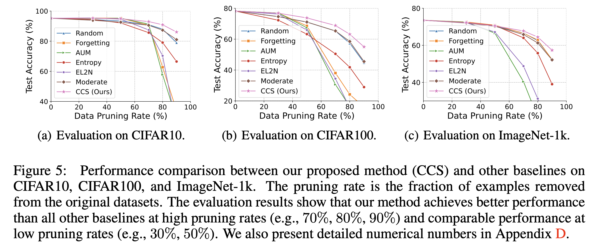

# Coverage-centric Coreset Selection for High Pruning Rates

Code implementation for ICLR 2023 paper: [Coverage-centric Coreset Selection for High Pruning Rates.](https://openreview.net/forum?id=QwKvL6wC8Yi)

Coverage-centric Coreset Selection (CCS) is a one-shot coreset selection algorithm jointly considering overall data coverage upon a distribution as well as the importance of each example.
Empirical evaluation in the paper demonstrates that CCS achieves  better accuracy than previous SOTA methods at high pruning rates and comparable accuracy at low pruning rates.

</img>

More evaluation results and technical details see our [paper](https://arxiv.org/abs/2210.15809).

# Usage and Examples

You can use `train.py` to reproduce baselines and CCS on CIFAR10, CIFAR100, SVHN, and CINIC10. Here we use CIFAR10 as an example, the detailed training setting can be found in our paper.

## Train classifiers with the entire dataset
This step is **necessary** to collect training dynamics for future coreset selection.
```
python train.py --dataset cifar10 --gpuid 0 --epochs 200 --lr 0.1 --network resnet18 --batch-size 256 --task-name all-data --base-dir ./data-model/cifar10
```

## Train classifiers with a coreset

### Importance score calculation
Except random pruning, we need to first calcualte the different importance scores for coreset selection.

```
python generate_importance_score.py --gpuid 0 --base-dir ./data-model/cifar10 --task-name all-data
```

### Train a model with a specific coreset selection method:
Here we use 90% pruning rate on CIFAR10 as an example.

**CCS with AUM**
```
python train.py --dataset cifar10 --gpuid 0 --iterations 40000 --task-name ccs-0.1 --base-dir ./data-model/cifar10/ccs --coreset --coreset-mode stratified --data-score-path ./data-model/cifar10/all-data/data-score-all-data.pickle --coreset-key accumulated_margin --coreset-ratio 0.1 --mis-ratio 0.3
```

**Random**
```
python train.py --dataset cifar10 --gpuid 0 --iterations 40000 --task-name random-0.1 --base-dir ./data-model/cifar10/random --coreset --coreset-mode random --coreset-ratio 0.1
```

**Forgetting**
```
python train.py --dataset cifar10 --gpuid 0 --iterations 40000 --task-name forgetting-0.1 --base-dir ./data-model/cifar10/forgetting --coreset --coreset-mode coreset --data-score-path ./data-model/cifar10/all-data/data-score-all-data.pickle --coreset-key forgetting --coreset-ratio 0.1 --data-score-descending 1
```

**AUM**
```
python train.py --dataset cifar10 --gpuid 0 --iterations 40000 --task-name accumulated_margin-0.1 --base-dir ./data-model/cifar10/accumulated_margin --coreset --coreset-mode coreset --data-score-path ./data-model/cifar10/all-data/data-score-all-data.pickle --coreset-key accumulated_margin --coreset-ratio 0.1 --data-score-descending 0
```

**EL2N**
```
python train.py --dataset cifar10 --gpuid 0 --iterations 40000 --task-name el2n-0.1 --base-dir ./data-model/cifar10/el2n --coreset --coreset-mode coreset --data-score-path ./data-model/cifar10/all-data/data-score-all-data.pickle --coreset-key el2n --coreset-ratio 0.1 --data-score-descending 1
```

# ImageNet training code
```
#Train imagenet classifier and collect the training dynamics
python train_imagenet.py --epochs 60 --lr 0.1 --scheduler cosine --task-name ICLR2023-ImageNet --base-dir /path/to/work-dir/imagenet/ --data-dir /dir/to/data/imagenet --network resnet34 --batch-size 256 --gpuid 0,1

#Calculate score for each image
python generate_importance_score_imagenet.py --data-dir /dir/to/data/imagenet --base-dir /path/to/work-dir/imagenet/ --task-name ICLR2023-ImageNet --data-score-path ./imagenet-data-score.pt

#Train model with CCS coreset selection
#90% pruning rate
python train_imagenet.py --iterations 300000 --iterations-per-testing 5000 --lr 0.1 --scheduler cosine --task-name aum-s-0.1 --data-dir /dir/to/data/imagenet --base-dir /path/to/work-dir/imagenet/ccs --coreset --coreset-mode stratified --data-score-path imagenet-data-score.pt --coreset-key accumulated_margin --network resnet34 --batch-size 256 --coreset-ratio 0.1 --mis-ratio 0.3 --data-score-descending 1 --gpuid 0,1 --ignore-td

#80% pruning rate
python train_imagenet.py --iterations 300000 --iterations-per-testing 5000 --lr 0.1 --scheduler cosine --task-name aum-s-0.2 --data-dir /dir/to/data/imagenet --base-dir /path/to/work-dir/imagenet/ccs --coreset --coreset-mode stratified --data-score-path imagenet-data-score.pt --coreset-key accumulated_margin --network resnet34 --batch-size 256 --coreset-ratio 0.2 --mis-ratio 0.2 --data-score-descending 1 --gpuid 0,1 --ignore-td
```